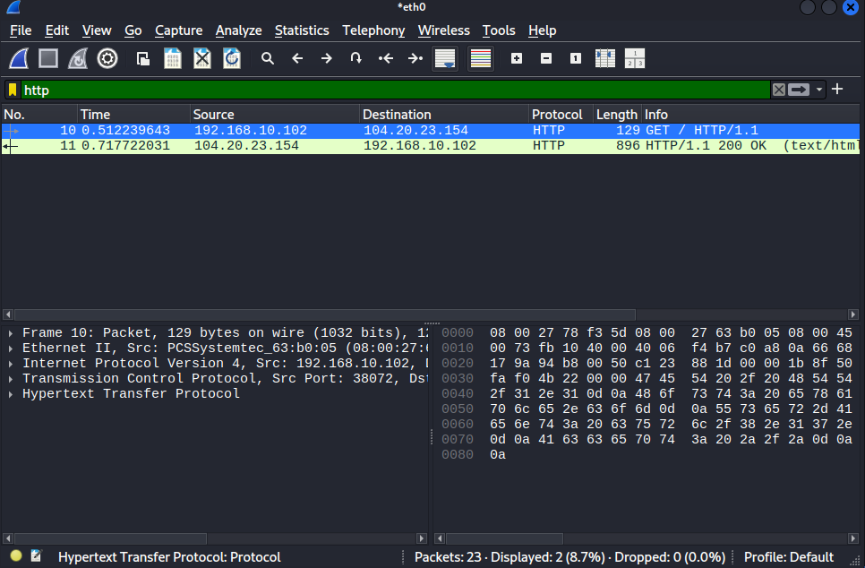
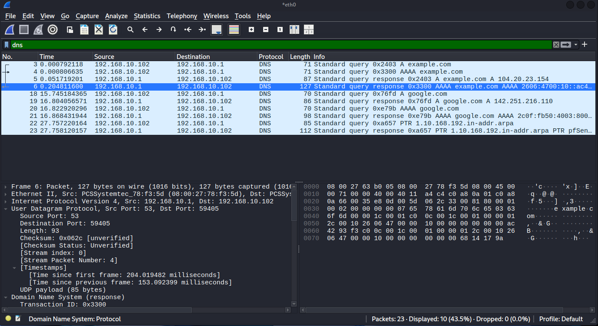
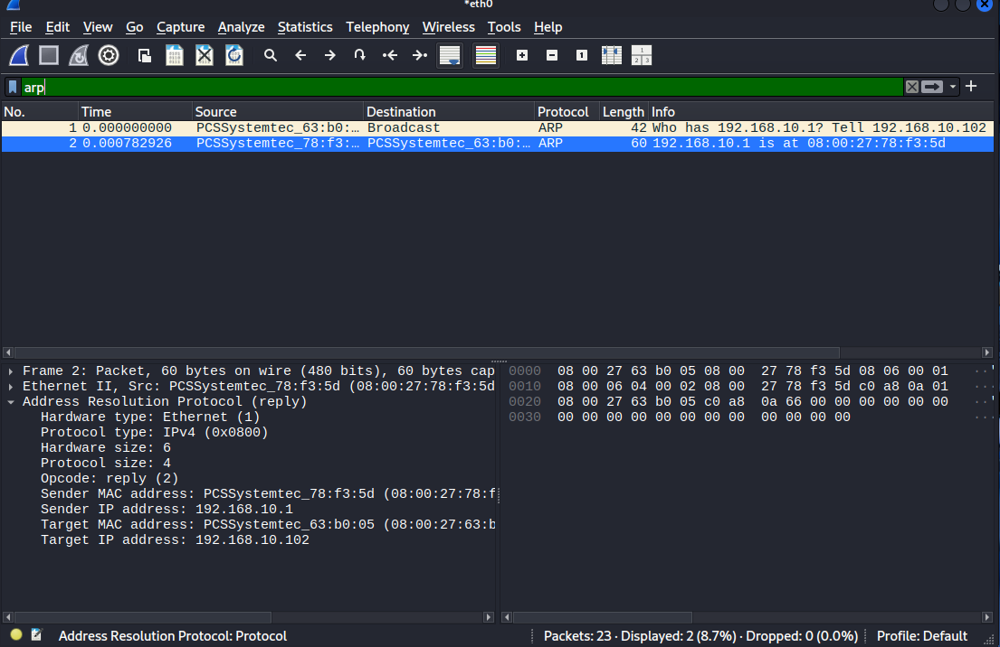
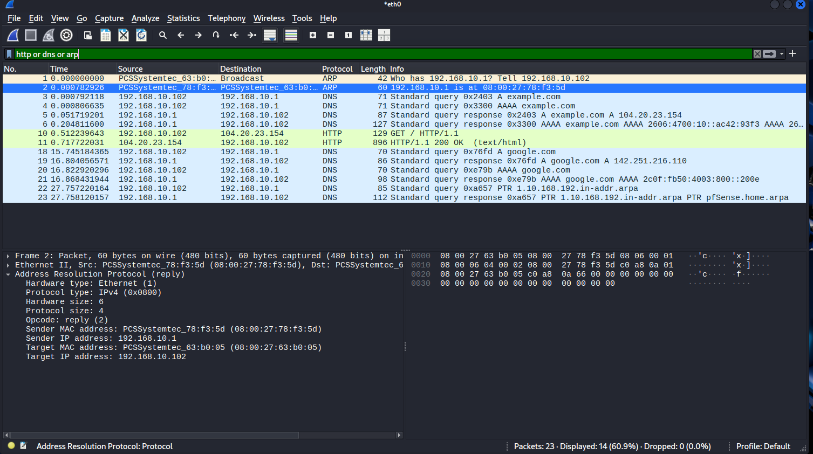

# HTTP, DNS and ARP Traffic Analysis
## Analyzing Core Network Protocols Using Wireshark

---

## Overview
HTTP, DNS and ARP are three of the most fundamental
network protocols, and three of the most abused by
attackers. This project captures and analyzes real
traffic for all three protocols using Wireshark on
Kali Linux, demonstrating normal behaviour and
explaining how each protocol is exploited.

---

## Objectives
- Capture real HTTP, DNS and ARP traffic live
- Analyze request and response patterns for each
- Understand why HTTP is dangerous vs HTTPS
- Identify how ARP poisoning works
- Recognize suspicious DNS patterns

---

## Tools Used
| Tool | Purpose |
|---|---|
| **Wireshark** | Live packet capture and analysis |
| **Kali Linux** | Traffic generation platform |
| **curl** | Generate HTTP traffic |
| **nslookup** | Generate DNS traffic |
| **arp** | Generate and view ARP traffic |

---

## Protocol Background

### DNS — Domain Name System
Translates human readable domain names into IP
addresses. Every internet connection starts with
a DNS query.

How it works:
Your computer asks DNS Server what is google.com
DNS Server responds with 142.251.216.110
Your computer connects to that IP

Key details:
- Port 53
- Uses UDP for speed
- Never blocked by firewalls 

DNS Attacks:
- DNS Poisoning: fake responses redirect victims
- DNS Tunneling: data hidden inside DNS queries
- DGA: malware generates random domains

---

### HTTP — HyperText Transfer Protocol
The language web browsers use to request and
receive web pages.

How it works:
Browser sends GET / HTTP/1.1 to server
Server responds HTTP/1.1 200 OK with the page

HTTP vs HTTPS:
- HTTP port 80 — unencrypted — anyone can read it(unsafe)
- HTTPS port 443 — encrypted with TLS — safe

HTTP Attacks:
- Credential theft: passwords visible in cleartext
- Man in the Middle: attacker reads and modifies traffic
- Command and Control: malware communicates via HTTP

---

### ARP — Address Resolution Protocol
Translates IP addresses to MAC addresses on a
local network. Operates at Layer 2, below IP.

How it works:
Kali broadcasts — Who has 192.168.10.1?
pfSense replies — That is me — 08:00:27:78:f3:5d

ARP Poisoning Attack:
Attacker sends fake reply to Kali saying
192.168.10.1 is at ATTACKER MAC ADDRESS
Kali now sends all gateway traffic to attacker
instead — Man in the Middle attack established.

---

## Methodology

### Commands Used to Generate Traffic

HTTP traffic:
curl http://example.com

DNS traffic:
nslookup google.com

ARP traffic:
arp -a

### Wireshark Filters Applied

HTTP only:
http

DNS only:
dns

ARP only:
arp

All three together:
http or dns or arp

---

## Results

### HTTP Traffic — GET Request and Response

### DNS Traffic — Query and Response

### ARP Traffic — Request and Reply

### All Three Protocols Together

---

## Analysis

### Finding 1 — HTTP Cleartext Confirmed
HTTP traffic between Kali and example.com showed
GET request and 200 OK response both fully readable.
An attacker on the same network could capture
this traffic and read everything including
credentials submitted via HTTP forms.

### Finding 2 — DNS Uses UDP Port 53
All DNS queries used UDP port 53.
Queries went to pfSense at 192.168.10.1
which acts as the local DNS resolver.

### Finding 3 — DNS Record Types Captured
Two record types observed:
| Record | Query | Purpose |
|---|---|---|
| A | example.com | IPv4 address lookup |
| AAAA | example.com | IPv6 address lookup |

### Finding 4 — ARP Broadcast and Reply
ARP exchange captured between Kali and pfSense:
Request — Who has 192.168.10.1 sent to Broadcast
Reply — 192.168.10.1 is at 08:00:27:78:f3:5d
pfSense MAC address confirmed as 08:00:27:78:f3:5d

### Finding 5 — Reverse DNS Lookup
A PTR record query was observed:
PTR 1.10.168.192.in-addr.arpa
Response confirmed gateway hostname as pfSense.home.arpa

### Finding 6 — Protocol Comparison
| Protocol | Layer | Port | Transport | Encrypted |
|---|---|---|---|---|
| ARP | 2 | None | None | No |
| DNS | 3 and 7 | 53 | UDP | No |
| HTTP | 7 | 80 | TCP | No |
| HTTPS | 7 | 443 | TCP | Yes |

---

## Security Relevance

### Why These Protocols Matter to SOC Analysts

DNS monitoring reveals:
- Every DNS query shows what devices are doing
- Unusual domains indicate DGA malware
- Long queries indicate DNS tunneling
- High NXDOMAIN rate indicates infected machine

HTTP monitoring reveals:
- Cleartext credentials visible in traffic
- C2 communication often uses HTTP
- Data exfiltration can happen over HTTP
- Malware downloads arrive via HTTP

ARP monitoring reveals:
- Unexpected ARP replies indicate poisoning attempt
- Multiple MACs for one IP indicates MITM attack
- Gratuitous ARP packets are suspicious activity

---

## Conclusion
Successfully captured and analyzed HTTP, DNS and
ARP traffic using Wireshark on Kali Linux.
Understanding normal protocol behaviour is
essential for detecting anomalies. You cannot
spot suspicious traffic without knowing what
normal looks like.

Key takeaways:
- HTTP is dangerous, always use HTTPS
- DNS reveals everything devices are doing
- ARP has no authentication, which makes it easy to poison
- All three protocols are regularly abused by attackers

---

## 🔗 Related Projects
- [TCP/IP Traffic Analysis](https://github.com/Phredreeq/tcp-ip-traffic-analysis)
- [Network Traffic Analysis](https://github.com/Phredreeq/network-traffic-analysis-wireshark)
- [DNS Analysis and Threat Detection](https://github.com/Phredreeq/dns-analysis-threat-detection)
- [Firewall Log Analysis](https://github.com/Phredreeq/firewall-log-analysis)

---

## 👤 Author
Fredrick Agufenwa

Cybersecurity Student | SOC & Threat Detection
